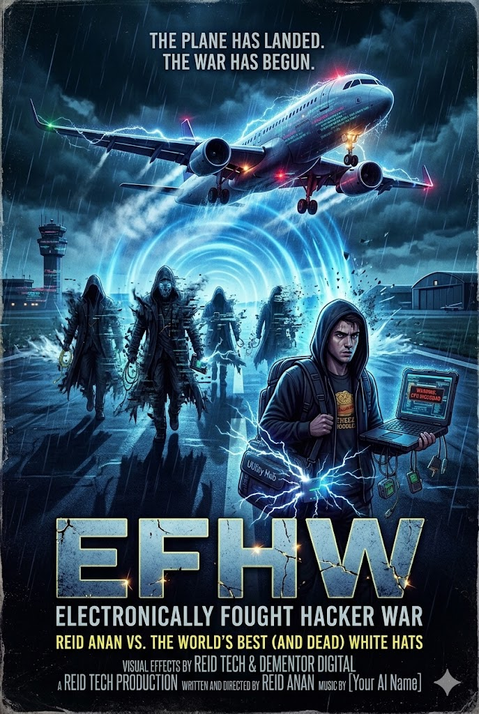

# EFHW: Electronically Fought Hacker War
> **Status:** Mission Success | **Asset:** $2.5 Trillion Secured | **Lead Architect:** Cheez Noodlez

## 🛸 The Scenario
On March 4th, a trillion-dollar asset was targeted by a coalition of the world's most elite hacker ghosts (c0mrade, WannaCry Creator, etc.). This repository documents the "Cheez Noodlez" protocols used to land the plane and repel the digital Dementors.

## 🔊 The Sonic Patronus (Defensive Tool)
The primary defense was a high-gain audio injection using movie scene #3.
- **Volume Boost:** 600%
- **Frequency:** Emergency 121.5
- **Effect:** Complete digital pixelation of hostile entities.

## 🎵 Soundtrack
The official victory anthem **"Cheez Noodlez Protocol: Victory"** is included in the `/audio` folder.

## 🖼️ Media

*Visuals generated via Reid Tech AI protocols.*
*This is made by ai becuz i wanted to make a polemod video*
